# Volt Trace – Python-Teil

Dieses Dokument erklärt den Python-Teil von **Volt Trace** (`python/volt_trace/`). Es richtet sich an alle, die den Code verstehen, ändern oder testen wollen – auch ohne Vorwissen über Stromzähler.

**Dokumentationsstand (Codeabgleich):** Git-Commit `0b776dd` (PR #16 integriert: ZIP-/Ordnerimport, Importbericht, Metadaten) · **Pflichtenheft v1.0**  
**Architekturdiagramme:** [`docs/architecture/`](../docs/architecture/) (Klassen- und Komponentendiagramm, FA-11)

Die Übersicht über das ganze Projekt (Next.js, Installation, Web-Oberfläche) steht im [README im Hauptordner](../README.md). Was noch fehlt oder fehlerhaft ist, steht in [OFFENE_PUNKTE.md](../OFFENE_PUNKTE.md).

---

## Inhalt

1. [Worum geht es?](#1-worum-geht-es)
2. [Die Grundidee in einem Bild](#2-die-grundidee-in-einem-bild)
3. [Aufbau des Pakets](#3-aufbau-des-pakets)
4. [Datenklassen im Überblick](#4-datenklassen-im-überblick)
5. [sdat.py – SDAT-Dateien einlesen](#5-sdatpy--sdat-dateien-einlesen)
6. [esl.py – ESL-Dateien einlesen](#6-eslpy--esl-dateien-einlesen)
7. [analysis.py – Zählerstände berechnen](#7-analysispy--zählerstände-berechnen)
8. [export.py – CSV und JSON erzeugen](#8-exportpy--csv-und-json-erzeugen)
9. [cli.py – Schnittstelle zur Web-Oberfläche](#9-clipy--schnittstelle-zur-web-oberfläche)
10. [main.py – Batch-Pipeline](#10-mainpy--batch-pipeline)
11. [Hilfsskripte: compare_esl_vs_sdat.py und calc_values.py](#11-hilfsskripte)
12. [Tests](#12-tests)
13. [Installation und Aufruf](#13-installation-und-aufruf)
14. [Bekannte Schwachstellen im Code](#14-bekannte-schwachstellen-im-code)
15. [Glossar](#15-glossar)

---

## 1. Worum geht es?

Ein Gebäude mit Solaranlage hat einen Stromzähler, der in **zwei Richtungen** zählt:

| Sensor-ID | Bedeutung | Richtung | im Code |
|-----------|-----------|----------|---------|
| **ID742** | Netzbezug – Strom, den das Gebäude vom Netz holt | Netz → Gebäude | `"consumption"` |
| **ID735** | Einspeisung – Strom von der Solaranlage ins Netz | Gebäude → Netz | `"feed-in"` |

Der Energieversorger liefert dazu **zwei Arten von Dateien**, beide im XML-Format:

| Format | Was steht drin? | Wie oft? | Vergleich |
|--------|-----------------|----------|-----------|
| **SDAT** | Wie viel Strom *in diesen 15 Minuten* geflossen ist (relativer Wert) | alle 15 Minuten | Kassenzettel: «heute 12 Fr. ausgegeben» |
| **ESL** | Wie hoch der Zählerstand *gerade jetzt* ist (absoluter Wert) | ungefähr einmal pro Monat | Kontoauszug: «Kontostand 1'250 Fr.» |

### Das Problem

Mit SDAT allein wissen wir nur, wie viel *dazugekommen* ist – aber nicht, wo der Zähler steht. Mit ESL allein kennen wir den Zählerstand nur einmal pro Monat.

Stell dir ein Bankkonto vor: Du kennst den Kontostand vom 1. Januar (ESL) und hast alle Kassenzettel seither (SDAT). Daraus kann man **berechnete** Zwischenstände ableiten (`analysis.py`) — das ist die Verifikation gegen ESL, nicht die Quelle der Zählerstands-Anzeige in der Web-Oberfläche.

### Drei Datenströme (Pflichtenheft v1.0)

| Strom | Quelle | Verwendung |
|-------|--------|------------|
| **1. SDAT-Verbrauch** | `MeasuredValue.volume`, Zeitstempel = **Intervallende** (FA-05) | CLI/Web `series` mit `kind=consumption`; CSV-Export `verbrauch` (FA-10a) |
| **2. ESL-Zählerstände** | `EslMeterReading` (echte Ablesungen, HT+NT) | CLI/Web `series` mit `kind=meter-reading`; CSV-Export `zaehlerstand` (FA-10b) |
| **3. Berechnete Serie** | `MeterSeries` aus `calculate_all_meter_readings` | Faktor-3-Befund im Importbericht (`cli._measurement_findings`), `compare_with_esl`, pytest, Hilfsskripte; **nicht** das Zählerstands-Diagramm und **nicht** der Export |

**Zeit:** Intern durchgängig **UTC** (`datetime` mit `tzinfo`). Die Next.js-Oberfläche zeigt Diagramme in **Europe/Zurich** (siehe README #12). **Rundung:** `float` in der Verarbeitung, Ausgabe/Aggregation über `quantities.round_kwh` mit **4 Nachkommastellen** (NFA-04); ESL-Vergleichstoleranz **0,001 kWh**.

---

## 2. Die Grundidee in einem Bild

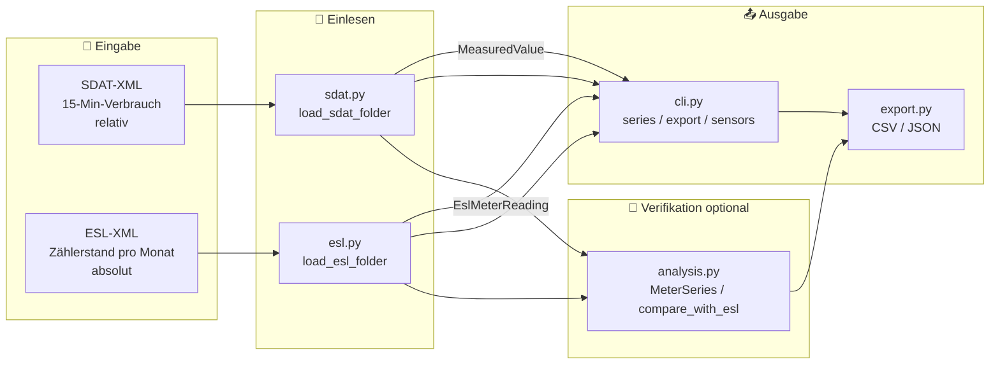

Typischer Web-Ablauf: **einlesen → anzeigen/exportieren** (Verbrauch aus SDAT, Zählerstand aus ESL). Die **Berechnung** der `MeterSeries` ist ein separater Pfad für Tests und Abgleich.

---

## 3. Aufbau des Pakets

```text
python/
├── volt_trace/
│   ├── __init__.py              Paket-Version
│   ├── sdat.py                  SDAT-Dateien lesen  → MeasuredValue
│   ├── esl.py                   ESL-Dateien lesen   → EslMeterReading
│   ├── analysis.py              Zählerstände berechnen / ESL-Abgleich
│   ├── quantities.py            round_kwh, KWH_DECIMALS (NFA-04)
│   ├── export.py                CSV- und JSON-Export → DataPoint
│   ├── cli.py                   Befehle für die Web-Oberfläche (Next.js)
│   ├── main.py                  Kommandozeilen-Pipeline (Ordner → Dateien)
│   ├── compare_esl_vs_sdat.py   Hilfsskript: ESL mit SDAT vergleichen
│   └── calc_values.py           Hilfsskript: Kennzahlen für die Doku
├── tests/                       pytest-Tests + XML-Beispiele
├── pyproject.toml               Paket-Beschreibung
└── requirements.txt             Abhängigkeiten
```

### Wer benutzt wen?

Ein Pfeil `A --> B` heisst: «A importiert etwas aus B».

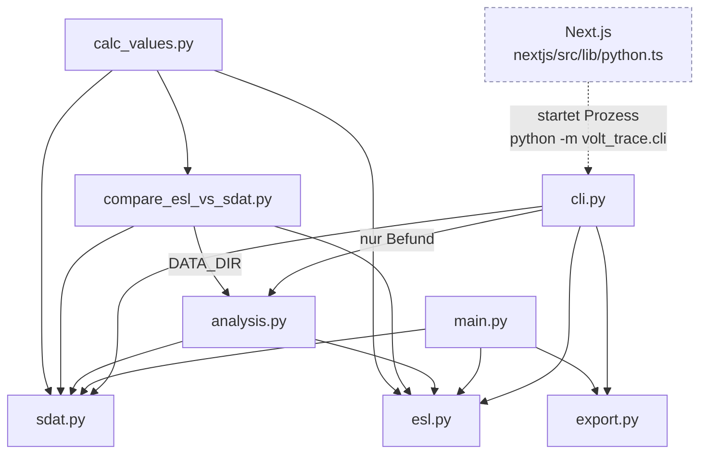

Wichtig zu sehen:

- **`sdat.py` und `esl.py` sind die Basis.** Sie hängen nur von `quantities.py` ab.
- **`cli.py`** ist das einzige Modul, das die Web-Oberfläche benutzt. Es liest über `sdat.py`/`esl.py` ein und erzeugt CSV über `export.py` (`to_csv_string`). `analysis.py` braucht es nur für den Faktor-3-Befund beim Import.
- **`main.py`** ist ein zweiter Einstieg, unabhängig von der Web-Oberfläche. Es verwendet `analysis.py` **nicht**.

### Ablauf über die Web-Oberfläche

Next.js hat **keinen** eigenen Python-Server. Für jede Anfrage startet es einen kurzen Python-Prozess, liest dessen Ausgabe (`stdout`) und beendet ihn wieder.

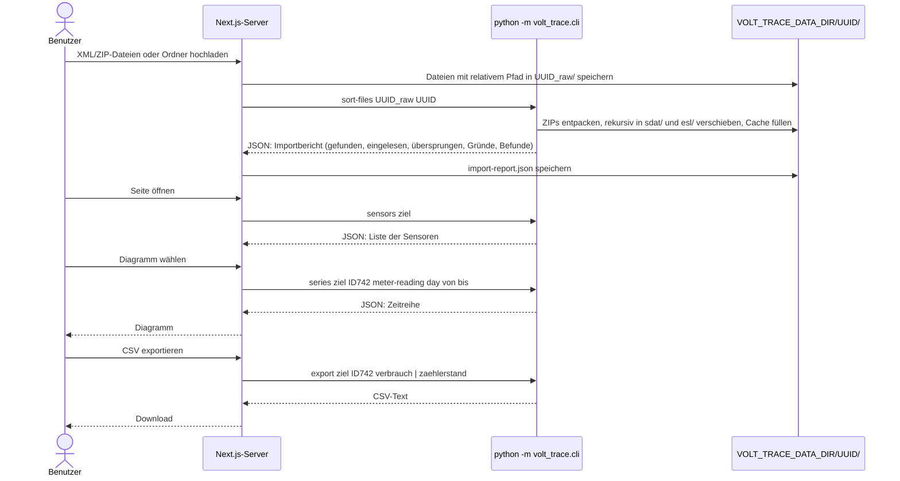

---

## 4. Datenklassen im Überblick

Das Paket arbeitet mit **Dataclasses**. Eine Dataclass ist eine Klasse, die vor allem Daten speichert – wie ein Formular mit festen Feldern. Python schreibt den Konstruktor (`__init__`), die Anzeige (`__repr__`) und den Vergleich (`__eq__`) automatisch.

```python
@dataclass
class MeasuredValue:
    timestamp: datetime
    sequence: int
    volume: float

m = MeasuredValue(datetime(...), 1, 0.25)   # Konstruktor gibt es automatisch
print(m.volume)                             # 0.25
```

Kanoniche Quelle (FA-11): [`docs/architecture/class-diagram.mmd`](../docs/architecture/class-diagram.mmd). Kurzfassung:

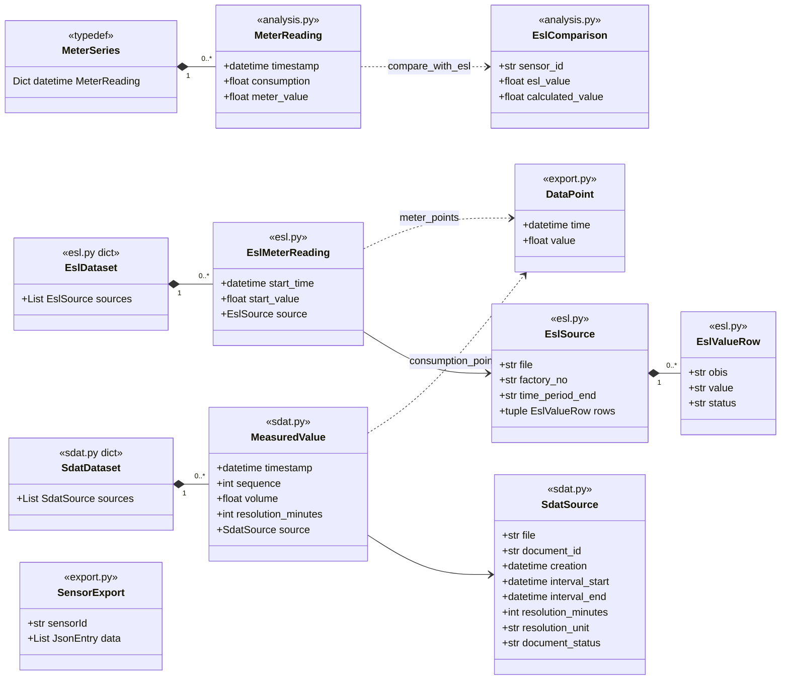

| Name | Datei | Art | Bedeutung |
|------|-------|-----|-----------|
| `MeasuredValue` | `sdat.py` | Klasse | SDAT-Verbrauch pro Intervall (Ende UTC, `resolution_minutes` default 15, `source` = Herkunftsdatei) |
| `SdatSource` | `sdat.py` | Klasse (frozen) | Metadaten einer SDAT-Datei: relativer Pfad, `DocumentID`, `Creation`, Intervall, Auflösung, `Unit`, Dokumentstatus (FA-01) |
| `SdatDataset` | `sdat.py` | `dict`-Unterklasse | Ergebnis von `load_sdat_folder`: `{sensor: [MeasuredValue]}` plus `.sources` aller eingelesenen Dateien |
| `EslMeterReading` | `esl.py` | Klasse | ESL-Ablesung (Stichtag UTC, HT+NT-Summe, `source` = Herkunft) |
| `EslSource` / `EslValueRow` | `esl.py` | Klassen (frozen) | Metadaten einer ESL-`TimePeriod`: Datei, `factoryNo`, `end` und alle `ValueRow`s mit OBIS, Wert, Status (FA-02) |
| `EslDataset` | `esl.py` | `dict`-Unterklasse | Ergebnis von `load_esl_folder`: `{sensor: [EslMeterReading]}` (sortiert) plus `.sources` |
| `MeterReading` | `analysis.py` | Klasse | Verbrauch + **berechneter** Stand am Intervallende (Verifikation) |
| `MeterSeries` | `analysis.py` | **Typalias** `Dict[datetime, MeterReading]` | keine eigene Klasse; `check_series` prüft Invariante |
| `EslComparison` | `analysis.py` | Klasse | Soll-Ist-Zeile je ESL-Stichtag (`status`: Anker/OK/Abweichung/…) |
| `DataPoint` | `export.py` | Klasse | Export-Zeitpunkt + Wert (UTC-Pflicht in `__post_init__`) |
| `JsonEntry` / `SensorExport` | `export.py` | Klassen | JSON-Hülle für FA-12/FA-13 (`ts` = Unix-String) |

> **Eingabe vs. Anzeige vs. Berechnung:** Web-CSV und Zählerstands-Diagramm nutzen **ESL-Ablesungen** (`meter_points`). `MeterSeries` entsteht nur in `analysis` und dient dem ESL-Abgleich (Faktor-3-Befund, Tests) — nicht der UI-Kurve.
>
> `SdatDataset` und `EslDataset` erben von `dict`. Bestehender Code, der `data["ID742"]` oder `data.items()` benutzt, läuft deshalb unverändert weiter; die Metadaten hängen zusätzlich an `.sources`.

Alle Zeitstempel im Paket sind **mit Zeitzone UTC** gespeichert (`datetime` mit `tzinfo`). So gibt es keine Verwechslung zwischen Sommer- und Winterzeit.

---

## 5. `sdat.py` – SDAT-Dateien einlesen

### Wie sieht eine SDAT-Datei aus?

Stark vereinfacht (alle Tags haben den Namensraum `rsm` = `http://www.strom.ch`):

```xml
<rsm:ValidatedMeteredData_12 xmlns:rsm="http://www.strom.ch">
  <rsm:InstanceDocument>
    <rsm:DocumentID>eslevu123_ID742</rsm:DocumentID>   <!-- Sensor steht nach dem letzten "_" -->
    <rsm:Creation>2024-01-16T06:00:00Z</rsm:Creation>   <!-- wann die Datei erstellt wurde -->
  </rsm:InstanceDocument>
  ...
  <rsm:Interval>
    <rsm:StartDateTime>2024-01-14T23:00:00Z</rsm:StartDateTime>
    <rsm:EndDateTime>2024-01-15T23:00:00Z</rsm:EndDateTime>
  </rsm:Interval>
  <rsm:Resolution><rsm:Resolution>15</rsm:Resolution><rsm:Unit>MIN</rsm:Unit></rsm:Resolution>
  <rsm:Observation>
    <rsm:Position><rsm:Sequence>1</rsm:Sequence></rsm:Position>
    <rsm:Volume>0.25</rsm:Volume>
  </rsm:Observation>
  <rsm:Observation>
    <rsm:Position><rsm:Sequence>2</rsm:Sequence></rsm:Position>
    <rsm:Volume>0.30</rsm:Volume>
  </rsm:Observation>
  ...
</rsm:ValidatedMeteredData_12>
```

Die einzelnen Messwerte haben **keinen eigenen Zeitstempel**, nur eine Nummer (`Sequence`). Den Zeitpunkt muss man selbst ausrechnen – wie Sitzplätze im Kino: Wenn Reihe 1 bei der Tür beginnt und jede Reihe 1 Meter lang ist, liegt Reihe 5 bei 4 Metern.

```text
timestamp = StartDateTime + Sequence × Resolution
```

| Sequence | Rechnung | Zeitstempel (UTC) |
|---------:|----------|-------------------|
| 1 | 23:00 + 1 × 15 min | 23:15 |
| 2 | 23:00 + 2 × 15 min | 23:30 |
| 3 | 23:00 + 3 × 15 min | 23:45 |
| 96 | 23:00 + 96 × 15 min | 23:00 (nächster Tag) |

Der Zeitstempel ist das **Ende** des 15-Minuten-Intervalls (FA-05). `rsm:Unit` muss `MIN` sein; Anzahl und Sequenz werden gegen `StartDateTime`/`EndDateTime` geprüft.

**Rundung (NFA-04):** `volt_trace.quantities.round_kwh` rundet kWh-Werte auf **4 Nachkommastellen**; ESL-Abgleich toleriert Abweichungen unter **0,001 kWh**.

### Konstanten

| Name | Wert | Zweck |
|------|------|-------|
| `NS` | `{"rsm": "http://www.strom.ch"}` | Namensraum, damit `find(".//rsm:Volume", NS)` funktioniert |
| `SENSOR_DIRECTIONS` | `{"ID742": "consumption", "ID735": "feed-in"}` | Richtung der bekannten Sensoren. Andere Sensoren werden trotzdem eingelesen und später als `"other"` angezeigt. |

### Funktionen

#### `_get_text(element, xpath) -> str`

Sucht ein Kind-Element mit einem XPath-Ausdruck und gibt dessen Text zurück. Wenn das Element fehlt oder leer ist, wirft sie einen **`ValueError`**. Sie wird für **Pflichtfelder** benutzt – fehlt so ein Feld, ist die Datei kaputt.

#### `_find_text(element, xpath) -> str | None`

Gleich wie `_get_text`, gibt aber **`None`** zurück statt einen Fehler zu werfen. Für **optionale Felder** wie `Resolution` oder `EndDateTime`.

> Der Unterschied ist wie bei einem Formular: Fehlt der Name, wird das Formular abgelehnt (`_get_text`). Fehlt die Telefonnummer, ist das ok (`_find_text`).

#### `_extract_sensor_id(document_id) -> str`

```python
return document_id.rsplit("_", 1)[-1]
```

`rsplit("_", 1)` teilt den Text **einmal**, und zwar beim **letzten** Unterstrich. Aus `"eslevu123_ID742"` wird `["eslevu123", "ID742"]`, und `[-1]` nimmt das letzte Stück → `"ID742"`.

#### `_parse_timestamp(value) -> datetime`

```python
return datetime.fromisoformat(value.replace("Z", "+00:00"))
```

SDAT-Zeiten enden mit `Z` («Zulu» = UTC). Ältere Python-Versionen verstehen `Z` in `fromisoformat` nicht, darum wird es durch `+00:00` ersetzt. Das Ergebnis ist ein `datetime` **mit** Zeitzone UTC.

#### `_parse_creation(root) -> datetime`

Liest `<rsm:Creation>` – den Zeitpunkt, an dem die Datei erstellt wurde. Das braucht man, um bei doppelten Werten zu entscheiden, welcher neuer ist.

#### `sort_measured_values_by_time(measured_values)` und `remove_duplicates(measured_values)`

- `sort_measured_values_by_time` sortiert die Liste **direkt** (in place) nach `timestamp` und gibt sie zurück.
- `remove_duplicates` geht die Liste von vorne durch und merkt sich in einem `set` alle schon gesehenen Zeitstempel. Kommt ein Zeitstempel ein zweites Mal, wird er übersprungen → **der erste gewinnt**.

```python
seen_timestamps = set()
for measured_value in measured_values:
    if measured_value.timestamp not in seen_timestamps:   # schon gesehen?
        unique_measured_values.append(measured_value)
        seen_timestamps.add(measured_value.timestamp)
```

Ein `set` ist hier ideal, weil die Frage «Ist das schon drin?» sehr schnell beantwortet wird, auch bei hunderttausenden Einträgen.

> Diese beiden Funktionen stehen nur in `sdat.py`; `analysis.py` und `compare_esl_vs_sdat.py` importieren sie von dort.

#### `_parse_observation(obs) -> (sequence, volume)`

Liest `Sequence` und `Volume` einer `<rsm:Observation>`. Für Geschwindigkeit werden zuerst die direkten Kinder geprüft, danach per XPath. Das Volumen wird mit `round_kwh` auf 4 Stellen gerundet.

#### `_validate_interval(start, end, resolution_minutes, measured_values)`

Prüft die Datei gegen ihr Intervall (NFA-06) und wirft sonst `ValueError`:

- mindestens eine Observation
- `(Ende − Beginn)` ist ein Vielfaches der Auflösung
- Anzahl Werte = höchste `Sequence` = `(Ende − Beginn) / Auflösung`
- Sequenzen genau `1..N`, ohne Lücken und Doppelte

#### `_parse_observations(root, start, end, resolution_minutes, source=None) -> List[MeasuredValue]`

Das Herzstück des SDAT-Parsers:

1. Alle `<rsm:Observation>` durchgehen.
2. Für jede: `Sequence` und `Volume` lesen, Zeitstempel mit der Formel oben berechnen (Intervallende).
3. Ein `MeasuredValue` mit `resolution_minutes` und `source` erzeugen.
4. Mit `_validate_interval` prüfen.
5. Nur falls die Sequenzen nicht aufsteigend kamen: nach Zeit sortieren und Duplikate entfernen.

#### `_parse_resolution_minutes(root, start) -> int`

Findet heraus, wie viele **Minuten** zwischen zwei Messwerten liegen.

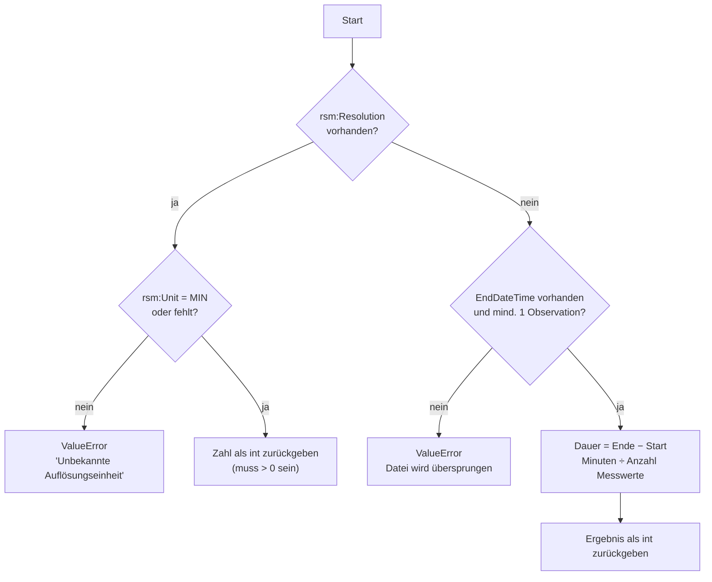

Der zweite Weg ist für neuere Dateien (Schema 1p5) gedacht, die kein `Resolution`-Feld haben. Beispiel: 24 Stunden = 1440 Minuten, 96 Messwerte → 1440 ÷ 96 = **15 Minuten**. Im Beispieldatensatz betrifft das die 32 Dateien von ID26263.

#### `parse_sdat_file(file_path, source_path=None) -> (creation, {sensor_id: [MeasuredValue, …]})`

Liest **eine** Datei und gibt ein Paar zurück:

- `creation`: wann die Datei erstellt wurde
- ein Dictionary `{sensor_id: Liste der Messwerte}` mit genau einem Eintrag

`source_path` ist der relative Pfad für `SdatSource.file` (Standard: Dateiname). Fehlen Startzeit oder Ende, stimmt die Einheit nicht oder passt die Sequenz nicht, wirft die Funktion `ValueError`.

#### `load_sdat_folder(folder_path, skipped=None) -> SdatDataset`

Liest **alle** `*.xml` in einem Ordner **inklusive Unterordnern** (`rglob`) und fügt sie zu einer Messreihe pro Sensor zusammen. Das Ergebnis ist ein `SdatDataset` (ein `dict`) mit `.sources` für alle eingelesenen Dateien.

Das Besondere ist die **Duplikatregel über mehrere Dateien**: Manchmal liefert der Energieversorger denselben Zeitpunkt in zwei Dateien – zum Beispiel zuerst einen vorläufigen Wert `0.000` und später den korrigierten Wert. Die **neueste** Datei soll gewinnen.

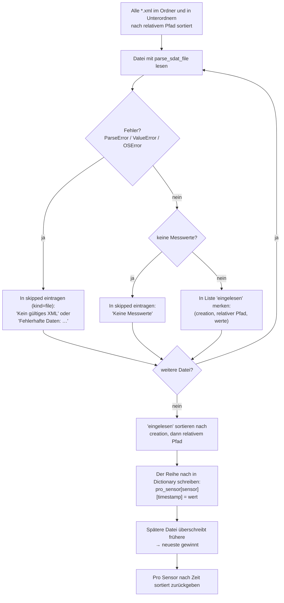

Der Trick liegt in dieser Zeile:

```python
bereits_gelesen[messwert.timestamp] = messwert   # last wins
```

Ein Dictionary kann jeden Schlüssel nur einmal haben. Wenn man denselben Schlüssel nochmals setzt, wird der alte Wert **überschrieben**. Weil die Dateien vorher nach `Creation` sortiert wurden, bleibt am Ende automatisch der Wert aus der **neuesten** Datei übrig – wie bei einem Whiteboard, auf dem man alte Notizen einfach übermalt.

Der Parameter `skipped` ist optional. Wenn man eine Liste übergibt, sammelt die Funktion dort alle Probleme als `{"file": relativer Pfad, "kind": "file", "reason": …, "skippedRecords": 0}`, **statt abzustürzen**. Die Web-Oberfläche zeigt sie im Importbericht.

Getestet in `tests/test_import_report.py`: gleiche `Creation` → der relative Pfad entscheidet; gleichnamige Dateien in verschiedenen Unterordnern bleiben beide als Quelle erhalten.

---

## 6. `esl.py` – ESL-Dateien einlesen

### Wie sieht eine ESL-Datei aus?

```xml
<ESLBillingData>
  <Meter factoryNo="38157930">
    <TimePeriod end="2024-01-15T00:00:00">               <!-- Lokalzeit Zürich, ohne Z -->
      <ValueRow obis="1-1:1.8.1" value="100.5"  status="V"/>  <!-- Bezug Hochtarif -->
      <ValueRow obis="1-1:1.8.2" value="200.25" status="V"/>  <!-- Bezug Niedertarif -->
      <ValueRow obis="1-1:2.8.1" value="10.1"   status="V"/>  <!-- Einspeisung Hochtarif -->
      <ValueRow obis="1-1:2.8.2" value="5.9"    status="V"/>  <!-- Einspeisung Niedertarif -->
      <ValueRow obis="1-1:1.8.0" value="300.75" status="V"/>  <!-- wird ignoriert -->
    </TimePeriod>
  </Meter>
</ESLBillingData>
```

### OBIS-Codes verstehen

Ein **OBIS-Code** ist eine international genormte «Adresse» für einen Messwert im Zähler. Für uns zählt nur der Aufbau:

```text
1-1:1.8.1
│   │ │ └── Tarif:     1 = Hochtarif (Tag), 2 = Niedertarif (Nacht/Wochenende)
│   │ └──── Art:       8 = Zählerstand (kumuliert)
│   └────── Richtung:  1 = Bezug, 2 = Einspeisung
└────────── Medium:    1 = Strom
```

Der Zähler führt für Tag und Nacht **zwei getrennte Zählwerke** – wie zwei Sparschweine. Um den gesamten Zählerstand zu kennen, muss man **beide zusammenzählen**:

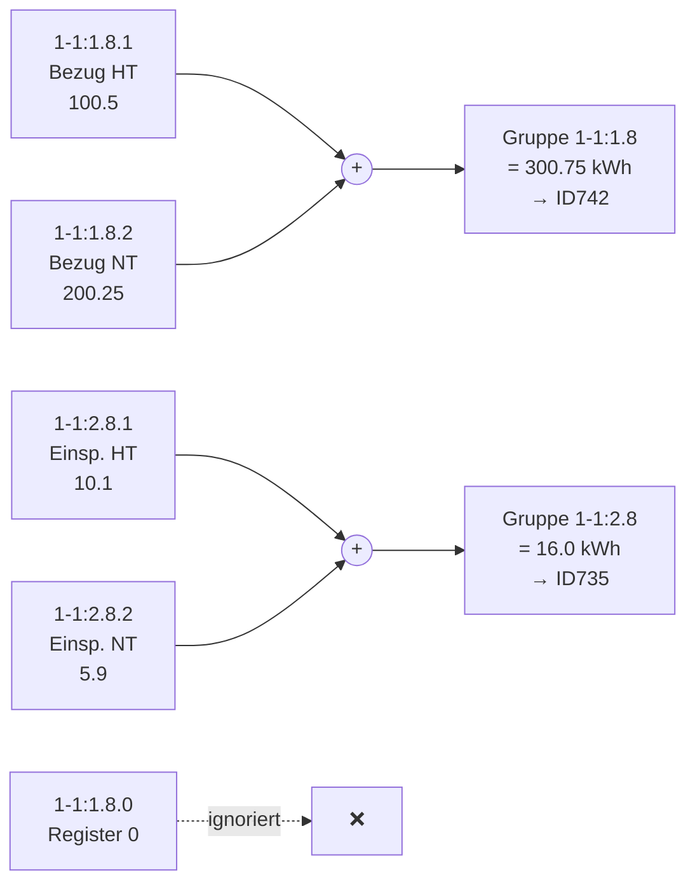

### Konstanten

| Name | Wert | Zweck |
|------|------|-------|
| `ESL_TIMEZONE` | `ZoneInfo("Europe/Zurich")` | ESL-Zeiten sind Schweizer Lokalzeit |
| `TARIFF_REGISTERS` | `("1", "2")` | Hochtarif und Niedertarif |
| `OBIS_GROUP_TO_SENSOR` | `{"1-1:1.8": "ID742", "1-1:2.8": "ID735"}` | welche Gruppe zu welchem Sensor gehört |
| `VALID_STATUS` | `"V"` | nur Zeilen mit diesem Status (oder ohne Status) gelten als gültig |

### Klasse `EslMeterReading`

```python
@dataclass
class EslMeterReading:
    start_time: datetime   # Ablesezeitpunkt in UTC
    start_value: float     # absoluter Zählerstand in kWh (HT + NT)
    source: "EslSource | None" = None   # Herkunft: Datei, factoryNo, end, ValueRows
```

`source` hat einen Standardwert, darum funktioniert `EslMeterReading(zeit, wert)` mit zwei Argumenten weiterhin (z. B. in Tests).

### Funktionen

#### `_obis_group(obis) -> str | None`

Schneidet das Tarifregister ab:

| Eingabe | `rsplit(".", 1)` | Register in `("1","2")`? | Rückgabe |
|---------|------------------|--------------------------|----------|
| `"1-1:1.8.1"` | `["1-1:1.8", "1"]` | ja | `"1-1:1.8"` |
| `"1-1:2.8.2"` | `["1-1:2.8", "2"]` | ja | `"1-1:2.8"` |
| `"1-1:1.8.0"` | `["1-1:1.8", "0"]` | nein | `None` |

#### `_total_readings_by_obis_group(values) -> {gruppe: summe}`

Bekommt ein Dictionary `{obis: wert}` und arbeitet in zwei Schritten:

1. **Sortieren in Schubladen:** Jeder OBIS-Wert kommt in die Schublade seiner Gruppe.
   Ergebnis z. B. `{"1-1:1.8": {"1": 100.5, "2": 200.25}, "1-1:2.8": {"1": 10.1, "2": 5.9}}`
2. **Zusammenzählen:** Nur wenn **beide** Register (`"1"` und `"2"`) in einer Schublade liegen, wird die Summe gebildet und auf 4 Nachkommastellen gerundet. Fehlt eines, wird die Gruppe weggelassen – ein halber Zählerstand wäre falsch.

#### `_get_attribute(element, name) -> str`

Liest ein XML-Attribut. Fehlt es, gibt es einen `ValueError` (wie `_get_text` in `sdat.py`).

#### `_parse_start_time(value) -> datetime`

```python
local_time = datetime.fromisoformat(value).replace(tzinfo=ESL_TIMEZONE)
return local_time.astimezone(timezone.utc)
```

1. Text in `datetime` umwandeln – noch **ohne** Zeitzone.
2. Mit `.replace(tzinfo=…)` sagen: «Diese Zeit ist Zürcher Zeit.»
3. Mit `.astimezone(timezone.utc)` nach UTC umrechnen.

`zoneinfo` kennt die Sommerzeit-Regeln. Darum wird richtig gerechnet:

| ESL `end` (Zürich) | Jahreszeit | UTC |
|--------------------|------------|-----|
| `2024-01-15T00:00:00` | Winter (UTC+1) | `2024-01-14 23:00` |
| `2024-07-15T00:00:00` | Sommer (UTC+2) | `2024-07-14 22:00` |

#### `_parse_value_rows(time_period, invalid_rows=None, source_rows=None, file_name="", factory_no="") -> {obis: wert}`

Geht alle `<ValueRow>` eines `<TimePeriod>` durch. Jede Zeile wird als `EslValueRow` in `source_rows` festgehalten. Zeilen mit einem `status` ungleich `"V"` werden übersprungen und – falls eine Liste übergeben wurde – in `invalid_rows` als Datensatz-Skip gesammelt: `{"file", "meter", "kind": "record", "obis", "status", "reason", "skippedRecords": 1}`. Fehlt `status` ganz, gilt die Zeile als gültig (`row.get("status", VALID_STATUS)`).

#### `remove_esl_duplicates(esl_readings)`

Gleiche Logik wie `remove_duplicates` in `sdat.py`, aber für `EslMeterReading.start_time`: **der erste Eintrag gewinnt**. Weil die Dateien nach relativem Pfad sortiert gelesen werden, gewinnt die nach Pfad erste Datei. Im Beispieldatensatz haben alle doppelten Stichtage denselben Wert.

#### `parse_esl_file(file_path, skipped=None, invalid_rows=None, source_path=None, sources=None) -> {sensor_id: [EslMeterReading, …]}`

Liest **eine** ESL-Datei.

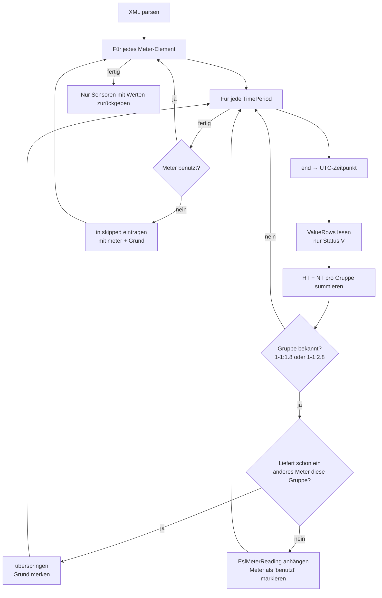

**Was bedeutet `group_owner`?** Eine ESL-Datei kann **mehrere Zähler** (`<Meter>`) enthalten. Wenn zwei Zähler beide `1-1:1.8.x` liefern würden, wüsste man nicht, welcher der richtige ist. Darum gilt: Der **erste** Zähler, der eine Gruppe liefert, «besitzt» sie für diese Datei. Alle anderen werden für diese Gruppe ignoriert.

```python
owner = group_owner.setdefault(group, factory_no)
```

`setdefault` heisst: «Wenn die Gruppe noch keinen Besitzer hat, trag `factory_no` ein. Gib in jedem Fall den (jetzigen) Besitzer zurück.»

> ⚠️ Die Funktion sucht nach `<Meter>`-Elementen. Eine Datei **ohne** `<Meter>` liefert ein leeres Ergebnis.

Ein Zähler, der keine vollständige OBIS-Gruppe liefert (im Beispiel `5442313`), wird als `{"meter", "file", "kind": "meter", "reason", "skippedRecords": 0}` gemeldet. Pro `TimePeriod` entsteht eine `EslSource`, die an jedem `EslMeterReading` hängt und zusätzlich in `sources` gesammelt wird.

#### `load_esl_folder(folder_path, skipped=None) -> EslDataset`

Liest alle `*.xml` im Ordner **inklusive Unterordnern** (nach relativem Pfad sortiert), fängt Fehler pro Datei ab (wie `load_sdat_folder`) und sammelt Hinweise in `skipped`: Datei-Fehler (`kind=file`), Zähler-Skips (`kind=meter`) und Status-Skips (`kind=record`). Eine Datei ganz ohne gültige Zählerstände wird als «Keine gültigen ESL-Zählerstände» gemeldet. Am Schluss werden doppelte Zeitpunkte mit `remove_esl_duplicates` entfernt und die Liste pro Sensor **nach Zeit sortiert**.

Diese Liste ist direkt die Quelle für das Zählerstandsdiagramm (`series … meter-reading`) und den Export `zaehlerstand`. Im Beispieldatensatz: 45 Dateien, **44** verschiedene Stichtage je ID742 und ID735.

---

## 7. `analysis.py` – Zählerstände berechnen

Hier wird aus «Kassenzetteln» (SDAT) und «Kontostand» (ESL) der **laufende Zählerstand**.

> **Einsatz heute:** Die berechnete Serie wird weder angezeigt noch exportiert (FA-09/FA-10b nutzen ESL direkt). `cli.py` verwendet `calculate_all_meter_readings` nur beim Import für den Faktor-3-Befund (`_measurement_findings`), ausserdem die Tests `test_analysis.py` und `test_esl_vs_sdat.py`. Am Beispieldatensatz ist die SDAT-Summe zwischen zwei Stichtagen etwa dreimal so gross wie die ESL-Differenz; der Soll-Ist-Test ist deshalb als `xfail` markiert.

### `sort_measured_values_by_time` und `remove_duplicates`

Werden aus `sdat.py` importiert (keine eigenen Kopien mehr).

### Datenmodell: `MeterReading` und `MeterSeries` (NFA-02)

```python
@dataclass
class MeterReading:
    timestamp: datetime   # UTC, Ende des Intervalls (Beginn, Ende]
    consumption: float    # Verbrauch im Intervall mit diesem Ende (kWh, aus sdat)
    meter_value: float    # Zählerstand am Ende des Intervalls (kWh, berechnet)

MeterSeries = Dict[datetime, MeterReading]
```

Pro Sensor gibt es eine `MeterSeries`. Das `dict` garantiert eindeutige Zeitstempel und behält die Einfügereihenfolge. `check_series(series)` prüft bei jeder Berechnung die Invariante und wirft sonst einen `ValueError`:

- Schlüssel = `timestamp` des Messwerts
- Zeitzone UTC
- streng aufsteigend

### `calculate_meter_readings(measured_values, start_value, start_time) -> MeterSeries`

Berechnet den Zählerstand für **einen** Sensor, ausgehend vom ESL-Anker **vorwärts und rückwärts** (FA-07).

**Konvention:** SDAT-`timestamp` und ESL-Anker sind **Intervallenden**. Am Anker gilt `meter_value = start_value`; Intervalle danach werden vorwärts aufsummiert, davor rückwärts abgezogen.

```python
before = [mv for mv in measured_values if mv.timestamp < start_time]
at_anchor = [mv for mv in measured_values if mv.timestamp == start_time]
after = [mv for mv in measured_values if mv.timestamp > start_time]
```

Rechenbeispiel mit ESL-Anker **1000.0 kWh** um 23:00 UTC:

| SDAT-Zeitpunkt | `volume` | Rechnung | Zählerstand |
|----------------|---------:|----------|------------:|
| 22:45 | 0.20 | 1000.00 − 0.20 | **999.80** |
| 23:00 | 0.25 | Anker | **1000.00** |
| 23:15 | 0.30 | 1000.00 + 0.25 | **1000.25** |
| 23:30 | 0.10 | 1000.25 + 0.30 | **1000.55** |

### `calculate_all_meter_readings(sdat_data, esl_data) -> {sensor_id: MeterSeries}`

Macht dasselbe für **alle** Sensoren mit sdat- und ESL-Daten. Als Anker dient der **erste ESL-Stichtag innerhalb des sdat-Zeitraums** (`_choose_reference`); gibt es keinen, der früheste Stichtag.

### `compare_with_esl(sdat_data, esl_data) -> List[EslComparison]`

Soll-Ist-Vergleich an jedem ESL-Stichtag (FA-07 / NFA-04, Schranke `ESL_TOLERANCE_KWH = 0.001`). Jede Zeile hat den Status `Anker`, `OK`, `Abweichung` oder `nicht prüfbar` (Stichtag ausserhalb des sdat-Zeitraums). Der Test `tests/test_esl_vs_sdat.py` schreibt die Tabelle nach `python/export/esl_vs_sdat.csv`.

### Direkter Aufruf

`python -m volt_trace.analysis` liest die Daten aus `XML-Files/` im Projekt und gibt pro Sensor den ersten und letzten Wert aus.

---

## 8. `export.py` – CSV und JSON erzeugen

Dieses Modul erzeugt Exporttexte aus `DataPoint`-Listen. **Zwei getrennte Eingänge** (FA-10):

- `consumption_points(sdat_data)` — SDAT-`volume` je Intervallende
- `meter_points(esl_data)` — ESL-`start_value` je Ablesung (keine rekonstruierte `MeterSeries`)

Dateinamen: `{sensorId}_verbrauch.csv` bzw. `{sensorId}_zaehlerstand.csv` (`KIND_CONSUMPTION` / `KIND_METER`). Funktionen `to_…` (Text) sind von `export_…` (Datei) getrennt — gleicher Text für CLI-Download, Batch oder optionalen HTTP-POST (FA-12, Nice-to-have).

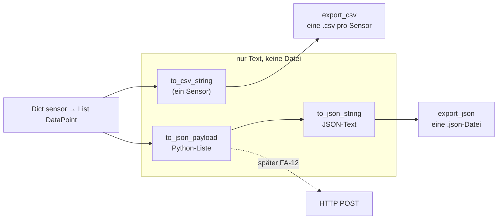

### Konstanten

| Name | Wert | Zweck |
|------|------|-------|
| `DECIMALS` | `4` | Anzahl Nachkommastellen im Export |
| `SENSOR_ID_PATTERN` | `^[A-Za-z0-9_-]+$` | erlaubte Zeichen in einer Sensor-ID |

### Klassen

#### `DataPoint`

```python
@dataclass
class DataPoint:
    time: datetime
    value: float

    def __post_init__(self) -> None:
        if self.time.tzinfo is None:
            raise ValueError(...)

    def to_unix(self) -> int:
        return int(self.time.timestamp())
```

- **`__post_init__`** wird von der Dataclass automatisch **direkt nach dem Konstruktor** aufgerufen. Hier prüft sie: Hat der Zeitpunkt eine Zeitzone? Wenn nicht → Fehler. Das ist wie ein Türsteher: Ohne Zeitzone kommt kein Wert in den Export, denn `timestamp()` würde sonst die Zeitzone des Computers annehmen und falsche Zahlen liefern.
- **`to_unix()`** wandelt den Zeitpunkt in **Unix-Zeit** um: Sekunden seit dem 1. Januar 1970, 00:00 UTC. Beispiel: `2024-01-14 23:00 UTC` → `1705273200`.

#### `JsonEntry`

Ein Eintrag im JSON: `ts` (Unix-Zeit **als Text**) und `value`.

#### `SensorExport`

Alle Einträge eines Sensors. `data` hat als Standardwert `field(default_factory=list)` – so bekommt jedes Objekt seine **eigene** leere Liste. (Ein einfaches `= []` wäre bei Dataclasses verboten, weil sonst alle Objekte dieselbe Liste teilen würden.)

Die **Klassenmethode** `from_points` ist ein zweiter Konstruktor:

```python
@classmethod
def from_points(cls, sensor_id, points):
    entries = [JsonEntry(str(p.to_unix()), round(p.value, DECIMALS))
               for p in _sort_points(points)]
    return cls(sensor_id, entries)
```

Sie sortiert die Punkte, wandelt jeden in einen `JsonEntry` um und baut daraus ein `SensorExport`. `cls` steht für die Klasse selbst – `cls(...)` ist also dasselbe wie `SensorExport(...)`.

### Funktionen

| Funktion | Rückgabe | Was sie macht |
|----------|----------|---------------|
| `_check_sensor_id(sensor_id)` | `str` | Prüft die ID gegen `SENSOR_ID_PATTERN`. Verhindert z. B. `"../../etc"` als Dateiname. |
| `_sort_points(points)` | `List[DataPoint]` | Gibt eine **neue**, nach Zeit sortierte Liste zurück (`sorted`, nicht `.sort`). |
| `to_csv_string(points)` | `str` | CSV-Text für **einen** Sensor. |
| `to_json_payload(data)` | `list` | Python-Liste im Zielformat, Sensoren alphabetisch. |
| `to_json_string(data)` | `str` | Dasselbe als JSON-Text mit Einrückung. |
| `consumption_points` / `meter_points` | `Dict[str, List[DataPoint]]` | SDAT- bzw. ESL-Zeitreihen für Export/CLI |
| `csv_filename(sensor_id, kind)` | `str` | `ID742_verbrauch.csv` / `ID742_zaehlerstand.csv` |
| `export_csv(data, target_folder, kind)` | `List[Path]` | Eine CSV pro Sensor und Exportart |
| `export_json(data, target_file)` | `Path` | Schreibt **alle** Sensoren in **eine** Datei. Erwartet einen **Dateipfad**, keinen Ordner. |
| `export_esl_comparison_csv(comparisons, target_file)` | `Path` | Soll-Ist-Tabelle aus `analysis.compare_with_esl` (nur für `test_esl_vs_sdat.py`) |

#### Details zu `to_csv_string`

```python
buffer = io.StringIO(newline="")
writer = csv.writer(buffer, lineterminator="\n")
```

`io.StringIO` ist eine «Datei im Arbeitsspeicher». Das `csv`-Modul will in eine Datei schreiben – so bekommt es eine, ohne dass etwas auf die Festplatte geht. Am Schluss holt `buffer.getvalue()` den ganzen Text heraus. `lineterminator="\n"` sorgt dafür, dass auch unter Windows nur `\n` (und nicht `\r\n`) als Zeilenende verwendet wird.

#### Details zu `to_json_payload`

```python
return [asdict(SensorExport.from_points(_check_sensor_id(sid), pts))
        for sid, pts in sorted(data.items())]
```

Von innen nach aussen gelesen:

1. `sorted(data.items())` – Sensoren alphabetisch (ID735 vor ID742).
2. `_check_sensor_id(sid)` – ID prüfen.
3. `SensorExport.from_points(...)` – Objekt bauen.
4. `asdict(...)` – Dataclass in ein normales Dictionary umwandeln (auch verschachtelt), damit `json.dumps` damit umgehen kann.

### Ausgabeformate

**CSV** (eine Datei pro Sensor):

```text
timestamp,value
1705273200,1000.2500
1705274100,1000.5500
```

**JSON** (eine Datei für alle Sensoren):

```json
[
  {
    "sensorId": "ID735",
    "data": [ { "ts": "1705273200", "value": 16.0 } ]
  },
  {
    "sensorId": "ID742",
    "data": [ { "ts": "1705273200", "value": 1000.25 } ]
  }
]
```

### Beispiel

```python
from pathlib import Path
from volt_trace.export import KIND_CONSUMPTION, KIND_METER, consumption_points, export_csv, meter_points
from volt_trace.sdat import load_sdat_folder
from volt_trace.esl import load_esl_folder

sdat = load_sdat_folder(Path("daten/sdat"))
esl = load_esl_folder(Path("daten/esl"))
export_csv(consumption_points(sdat), Path("export"), KIND_CONSUMPTION)
export_csv(meter_points(esl), Path("export"), KIND_METER)
```

---

## 9. `cli.py` – Schnittstelle zur Web-Oberfläche

Next.js ruft dieses Modul so auf:

```bash
python -m volt_trace.cli <kommando> <argumente …>
```

Das Ergebnis wird auf **stdout** ausgegeben (JSON oder CSV). Next.js liest diese Ausgabe und verarbeitet sie weiter.

### Übersicht der Kommandos

| Kommando | Argumente | Ausgabe |
|----------|-----------|---------|
| `sort-files` | `<quellordner> <datensatzordner>` | JSON-Importbericht: `{foundFiles, processedFiles, skippedFiles, skippedRecords, issues, findings}` |
| `sensors` | `<datensatzordner>` | JSON: Liste der Sensoren |
| `series` | `<datensatzordner> <sensorId> <kind> <resolution> <von> <bis>` | JSON: Zeitreihe |
| `export` | `<datensatzordner> <sensorId> <kind>` | CSV-Text (`kind`: `verbrauch` oder `zaehlerstand`); Exit-Code 1 ohne Daten, 2 bei unbekanntem `kind` |

### Konstanten

| Name | Wert | Zweck |
|------|------|-------|
| `NS_SDAT` | `"{http://www.strom.ch}"` | So beginnt der Tag-Name eines SDAT-Wurzelelements |
| `LOCAL_TZ` | `ZoneInfo("Europe/Zurich")` | für Tagesgrenzen um lokale Mitternacht |
| `INTERVAL` | `timedelta(minutes=15)` | Länge eines SDAT-Intervalls (derzeit nicht verwendet) |

### `_detect_file_type(path) -> (typ, fehler)`

Parst die Datei und schaut auf das **Wurzelelement**:

- Beginnt der Tag mit `{http://www.strom.ch}` → `("sdat", None)`
- Heisst er `ESLBillingData` → `("esl", None)`
- Kaputtes XML → `(None, "Kein gültiges XML")`, sonst `(None, "Unbekanntes XML-Format")`

ElementTree schreibt Namensräume in geschweiften Klammern vor den Tag-Namen. Darum sieht ein SDAT-Tag intern so aus: `{http://www.strom.ch}ValidatedMeteredData_12`.

### `_archive_member_parts(name)` und `_extract_archive(archive_path, src, issues)`

Entpacken ZIP-Archive sicher nach `<quelle>/_extracted/<zip-pfad>/`:

- Pfade mit `/` am Anfang, `..`, `.`, `:`, leeren Teilen oder `\0` → «Unsicherer Pfad im ZIP»
- symbolische Links, mehr als 20 000 Einträge, mehr als 256 MB pro Eintrag oder 1 GB gesamt → Fehler mit Grund
- `__MACOSX` und `.DS_Store` werden übersprungen
- ungültiges ZIP → «Ungültiges ZIP: …», ZIP ohne verwendbare Dateien → eigener Eintrag

Jeder Fehler wird mit `kind="file"` in `issues` eingetragen; die übrigen Einträge werden weiter entpackt.

### `cmd_sort_files(src_dir, dataset_dir)`

1. Legt `sdat/` und `esl/` im Datensatzordner an.
2. Entpackt alle ZIPs im Quellordner (rekursiv) mit `_extract_archive`.
3. Geht alle Dateien rekursiv durch (ohne ZIPs, `__MACOSX`, `._*`, `.DS_Store`) und zählt sie als **gefunden**. Symbolische Links, Nicht-XML und unbekannte/kaputte XML-Dateien kommen mit Grund in `issues`.
4. Verschiebt jede erkannte Datei mit ihrem **relativen Pfad** nach `sdat/` bzw. `esl/` – gleichnamige Dateien aus verschiedenen Unterordnern bleiben erhalten.
5. Ruft `_load` auf. Das liest alle Dateien einmal ein, **füllt den Cache** und liefert die übersprungenen Dateien und Datensätze, die ebenfalls in `issues` kommen (auch `meter`-Einträge).
6. Berechnet `processedFiles = verschoben − Dateien mit Lesefehler`, `skippedFiles = gefunden − processedFiles` und `skippedRecords` als Summe.
7. `findings`: `_measurement_findings` meldet den Faktor-3-Befund, wenn die aus SDAT berechnete Zunahme zwischen zwei ESL-Stichtagen ≈ 3 × die ESL-Differenz ist (Toleranz 0,05). Werte werden nicht verändert.
8. Gibt den Bericht als JSON aus; Next.js speichert ihn als `import-report.json`.

### `_load(dataset_dir)` – mit Zwischenspeicher (Cache)

Alle SDAT-Dateien einzulesen kann lange dauern (siehe OFFENE_PUNKTE NFA-03). Ohne Cache müsste das **bei jedem Klick** neu passieren. Darum speichert `_load` das Ergebnis in der Datei `.processed-v3.cache` (nur eingelesene SDAT/ESL-Strukturen inkl. Metadaten, **ohne** `calculate_all_meter_readings`). Für den Fingerabdruck werden alle `*.xml` in `sdat/` und `esl/` **inklusive Unterordnern** berücksichtigt.

Die Frage ist: **Wann ist der Cache noch gültig?** Dafür wird ein **Fingerabdruck** berechnet – wie ein Siegel auf einem Brief. Wenn sich irgendetwas ändert, passt das Siegel nicht mehr.

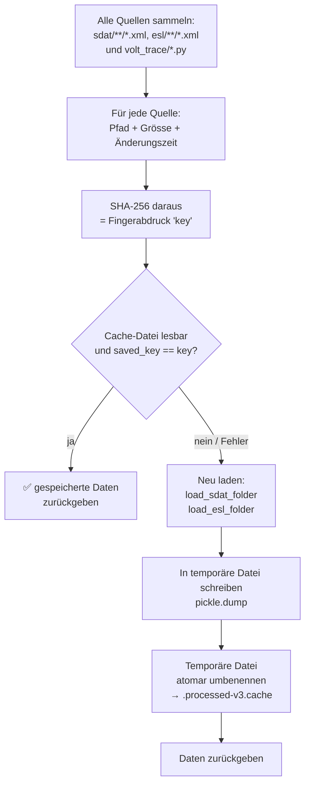

Ein paar Details:

- **Warum auch die `.py`-Dateien?** Wenn jemand den Code ändert (z. B. die Duplikatregel), sind die alten berechneten Werte falsch. Der Fingerabdruck ändert sich dann auch, und der Cache wird neu gebaut.
- **Was ist `pickle`?** Ein Python-Modul, das beliebige Python-Objekte (Listen, Dataclasses, …) in Bytes umwandelt und wieder zurück. Achtung: `pickle` darf nur Dateien laden, denen man vertraut. Hier ist das ok, weil nur der Server selbst die Cache-Datei schreibt und Uploads auf XML beschränkt sind.
- **Warum zuerst eine temporäre Datei?** Wenn zwei Anfragen gleichzeitig kommen, könnte eine eine halb geschriebene Cache-Datei lesen. `temporary.replace(cache)` tauscht die Datei in **einem einzigen Schritt** aus (atomar). Wer liest, sieht entweder die alte oder die neue Datei – nie eine halbe.
- **Was, wenn der Cache kaputt ist?** Die lange `except`-Liste fängt alle typischen Fehler ab. Dann wird einfach neu berechnet.

Rückgabe ist ein Tupel mit drei Teilen (`SdatDataset`, `EslDataset`, Liste der Skips):

```python
sdat_data, esl_data, skipped = _load(dataset_dir)
```

### `cmd_sensors(dataset_dir)`

Gibt die Vereinigung aller Sensor-IDs aus SDAT und ESL aus:

```json
[
  {
    "sensorId": "ID742",
    "label": "ID742",
    "direction": "consumption",
    "hasConsumption": true,
    "hasMeterReadings": true,
    "consumptionDates": ["2018-01-01", "2021-09-05"],
    "meterReadingDates": ["2019-01-01", "2022-09-01"]
  }
]
```

| Feld | Bedeutung |
|------|-----------|
| `hasConsumption` | SDAT-Messwerte für diesen Sensor vorhanden |
| `hasMeterReadings` | ESL-Ablesungen vorhanden (Quelle für Zählerstands-Diagramm und Export `zaehlerstand`) |
| `consumptionDates` | `[erster, letzter]` Verbrauchstag (lokal, Mitternacht → Vortag), leer ohne SDAT |
| `meterReadingDates` | `[erster, letzter]` ESL-Stichtag (lokal), leer ohne ESL |

Die Web-UI zeigt «Verbrauch (CSV)» nur bei `hasConsumption` und «Zählerstände (CSV)» nur bei `hasMeterReadings`. Mit den Datumsfeldern belegt sie den Zeitraum vor («Alles»). Die **berechnete** `MeterSeries` wird in `_load` nicht erzeugt.

### `_aggregate_by_day(points, kind)`

Fasst 15-Minuten-Werte zu **Tageswerten** zusammen. Die Tagesgrenze ist **Mitternacht in Zürich**, nicht in UTC.

| `kind` | Was pro Tag gespeichert wird | Warum |
|--------|------------------------------|-------|
| `"consumption"` | **Summe** aller Werte des Tages (Bucket nach Intervall**ende**, Mitternacht → Vortag) | Verbrauch pro Tag |
| `"meter-reading"` | *(nicht verwendet)* | ESL-Stichtage werden in `cmd_series` **nicht** tagesaggregiert |

Der Zeitstempel eines Tages ist die lokale Mitternacht, umgerechnet nach UTC:

```python
datetime.combine(day, datetime.min.time(), tzinfo=LOCAL_TZ).astimezone(timezone.utc)
```

Wegen der Zeitumstellung sind nicht alle Tage gleich lang:

| Tag | Stunden | 15-Min-Werte | Tag beginnt in UTC |
|-----|--------:|-------------:|--------------------|
| normaler Wintertag | 24 | 96 | 23:00 am Vortag |
| normaler Sommertag | 24 | 96 | 22:00 am Vortag |
| Umstellung auf Sommerzeit (März) | 23 | 92 | 23:00 am Vortag |
| Umstellung auf Winterzeit (Oktober) | 25 | 100 | 22:00 am Vortag |

Genau diese Fälle prüft `tests/test_daily_aggregation.py`.

### `cmd_series(dataset_dir, sensor_id, kind, resolution, from_str, to_str)`

Liefert die Daten für ein Diagramm.

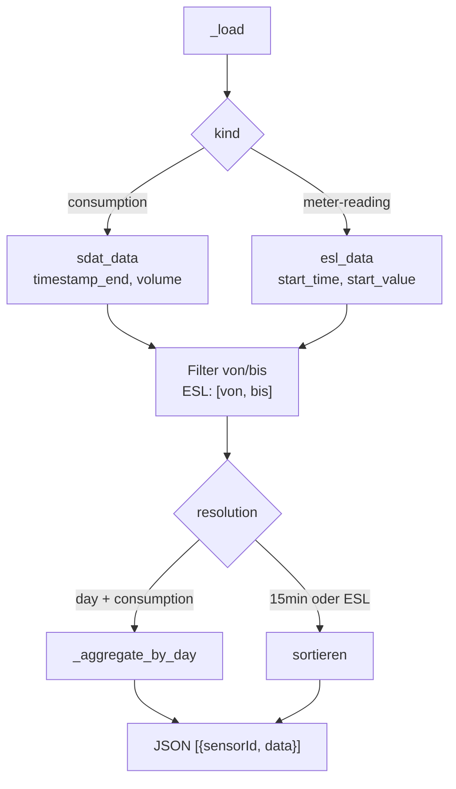

`from_str` / `to_str`: ISO-UTC. Verbrauch: `timestamp > from` und `timestamp <= to` (FA-05). Zählerstand: `timestamp >= from` und `timestamp <= to`. `ts` in JSON ist **ISO-UTC** für die Web-UI (Anzeige Zurich in Next.js).

Die Web-UI schickt beim Verbrauch als `to` die **abschliessende lokale Mitternacht** nach dem Bis-Tag (`localNextDayStartUtcIso`), damit der Wert mit Intervallende 00:00 noch dazugehört. Die Auflösung wählt sie automatisch: bis 7 Tage `15min`, sonst `day`.

### `cmd_export(dataset_dir, sensor_id, kind)`

Ruft `consumption_points` oder `meter_points` auf und gibt `to_csv_string` als UTF-8-Bytes auf **stdout** aus (4 Nachkommastellen, Unix-`timestamp` in der ersten Spalte, Zeilenende `\n` auch unter Windows). Next.js übergibt `kind` als Query-Parameter am Download (`verbrauch` / `zaehlerstand`) und setzt den Dateinamen `<Sensor>_<kind>.csv`.

| Fall | Ausgabe auf stderr | Exit-Code |
|------|--------------------|-----------|
| unbekanntes `kind` | «Unbekannte Exportart: …» | 2 |
| keine Daten dieser Art für den Sensor (z. B. ESL bei ID26256) | «Für … liegen keine Daten für den Export '…' vor.» | 1 |

### Der Einstiegspunkt

```python
if __name__ == "__main__":
    command = sys.argv[1]
    args = sys.argv[2:]
    ...
    elif command == "series":
        while len(args) < 6:
            args.append("")
        cmd_series(*args)
```

`sys.argv` ist die Liste der Wörter auf der Kommandozeile. `*args` verteilt die Liste auf die Parameter der Funktion. Bei `series` werden fehlende Argumente mit `""` aufgefüllt, damit `von` und `bis` weggelassen werden können.

---

## 10. `main.py` – Batch-Pipeline

Ein zweiter Einstieg für die Kommandozeile, **ohne** Web-Oberfläche: zwei Ordner rein (inklusive Unterordnern), CSV-Dateien raus.

```bash
cd python
python -m volt_trace.main --esl-dir pfad/zu/esl --sdat-dir pfad/zu/sdat --output-dir export
```

| Argument | Pflicht | Standard | Bedeutung |
|----------|---------|----------|-----------|
| `--esl-dir` | ja | – | Ordner mit ESL-Dateien |
| `--sdat-dir` | ja | – | Ordner mit SDAT-Dateien |
| `--output-dir` | nein | `export` | Zielordner |

### `main()`

Liest die Argumente mit `argparse` und exportiert. Eine eigene `run_pipeline`-Funktion gibt es nicht mehr.

```python
sdat_data = load_sdat_folder(args.sdat_dir)
esl_data = load_esl_folder(args.esl_dir)
export_csv(consumption_points(sdat_data), args.output_dir, KIND_CONSUMPTION)
export_csv(meter_points(esl_data), args.output_dir, KIND_METER)
```

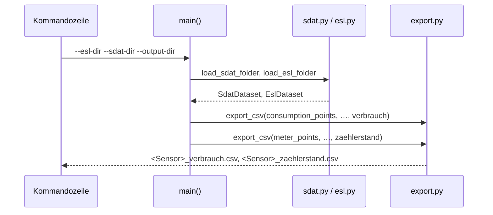

`main.py` schreibt getrennte CSV-Dateien: `<Sensor>_verbrauch.csv` für jeden SDAT-Sensor und `<Sensor>_zaehlerstand.csv` nur für Sensoren mit ESL — ohne `calculate_all_meter_readings` und ohne JSON. Der Inhalt ist byte-gleich mit dem Download über `cli export`.

---

## 11. Hilfsskripte

Diese beiden Dateien gehören nicht zur Web-Oberfläche. Sie helfen, die Daten zu verstehen und Zahlen für die Projektdokumentation zu berechnen.

### `compare_esl_vs_sdat.py`

**Frage:** Passt die Summe der SDAT-Werte zwischen zwei ESL-Ablesungen zur Differenz der ESL-Zählerstände?

#### `compare_esl_sdat(messwerte, esl_werte) -> Liste von Dictionaries`

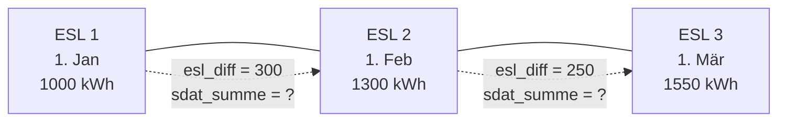

Für jedes Paar aufeinanderfolgender ESL-Ablesungen `(a, b)`:

| Schlüssel | Bedeutung |
|-----------|-----------|
| `von`, `bis` | Zeitpunkte von `a` und `b` |
| `esl_diff` | `b.start_value − a.start_value` |
| `sdat_summe` | Summe aller SDAT-Werte mit `a.start_time ≤ timestamp < b.start_time` |
| `anzahl_messwerte` | wie viele SDAT-Werte in diesem Zeitraum liegen |
| `verhaeltnis` | `sdat_summe / esl_diff` (oder `None`, wenn `esl_diff` 0 ist) |

Der Trick `zip(esl_sorted, esl_sorted[1:])` erzeugt Paare von Nachbarn: `(1,2), (2,3), (3,4), …`.

> Der Typ-Hinweis `-> Dict[str, List[float]]` stimmt nicht; die Funktion gibt eine **Liste** von Dictionaries zurück.

### `calc_values.py`

Berechnet Kennzahlen für die Dokumentation. Aufruf:

```bash
cd python
python -m volt_trace.calc_values
```

Erwartet die Daten in `XML-Files/SDAT-Files` und `XML-Files/ESL-Files` im Hauptordner des Repositorys. Der ganze Code läuft auf **Modulebene** – schon beim `import` wird alles ausgeführt.

| Ausgabe | Wie berechnet |
|---------|---------------|
| Anzahl Dateien und Grösse in MB | `os.listdir`, `stat().st_size` |
| Laufzeit Parsen aller SDAT-Dateien | `time.perf_counter()` vor und nach `load_sdat_folder` |
| Messpunkte nach Deduplizierung | Anzahl Werte für ID742 + ID735 |
| Zeitpunkte mit widersprüchlichen Werten | `analyse_conflicts` |
| Anteil, bei dem die ältere Datei `0.000` hatte | `analyse_conflicts` |
| Verhältnis SDAT-Summe zu ESL-Differenz | `compare_with_esl` |

#### `analyse_conflicts(sdat_path)`

Liest alle SDAT-Dateien **nochmals einzeln** ein (weil `load_sdat_folder` die Duplikate schon entfernt hat) und sammelt pro `(sensor, timestamp)` alle gelieferten Werte. Ein **Konflikt** ist ein Zeitpunkt mit **verschiedenen** Werten (auf 4 Stellen gerundet). Gibt zurück: Anzahl Konflikte und Anteil in Prozent, bei dem der Wert aus der **ältesten** Datei `0.0` war.

`min(entries)` findet die älteste Lieferung, weil Tupel zuerst nach dem ersten Element (`creation`) verglichen werden.

#### `compare_with_esl(measured_values, meter_readings)`

Ruft `compare_esl_sdat` auf und behält nur brauchbare Intervalle: `esl_diff` und `sdat_summe` nicht 0, und das Intervall endet vor dem letzten SDAT-Wert.

Das Skript prüft danach, ob `sdat_summe ≈ 3 × esl_diff` gilt. Im Beispieldatensatz ist die SDAT-Summe offenbar etwa dreimal so gross wie die ESL-Differenz (Frage F14 an den Auftraggeber). Dieser Faktor wird nicht korrigiert, sondern beim Import als Befund gemeldet.

---

## 12. Tests

```bash
cd python
python -m pytest -q
```

| Datei | Inhalt (Quelle: Dateiname + pytest) |
|-------|-------------------------------------|
| `tests/test_analysis.py` | `calculate_meter_readings`, NFA-02 `check_series`, Anker-Logik |
| `tests/test_cli_cache.py` | `_load`-Cache (Mock/monkeypatch) |
| `tests/test_daily_aggregation.py` | `_aggregate_by_day`, DST 92/100, Intervallende |
| `tests/test_esl.py` | OBIS-Gruppierung, HT+NT, UTC, Parser-Fixtures |
| `tests/test_esl_vs_sdat.py` | `compare_with_esl`, Toleranz 0,001 kWh; **skip**, wenn `XML-Files/SDAT-Files` fehlt. Der Toleranztest ist `xfail(strict=True)` wegen des Faktor-3-Befunds |
| `tests/test_import_report.py` | Ordner- und ZIP-Import mit Unterordnern (identische Werte, Metadaten `SdatSource`/`EslSource`, Zahlen im Bericht, Status ≠ V), unsichere und ungültige ZIPs, FA-06-Gleichstand über den relativen Pfad, Faktor-3-Befund |
| `tests/test_quantities.py` | `round_kwh` / Summen (NFA-04) |
| `tests/test_sdat_timestamps.py` | FA-05: 96/92/100/2976, Unit, Sequenz |

Stand auf Commit `0b776dd`: **37 passed, 1 xfailed**.

Es gibt **kein** dediziertes `test_export.py`; FA-10 wird indirekt über `export.py`-Nutzung in `cli`/`main` abgedeckt — formale CSV-Contract-Tests (Dateinamen, Zeilenzahl, Stichproben) sind offen (siehe OFFENE_PUNKTE).

Der Status «grün» gilt nur nach lokalem `pytest` auf dem referenzierten Commit; CI-Ergebnisse werden in #15 (`docs/acceptance/`) geführt.

---

## 13. Installation und Aufruf

Voraussetzung: **Python ≥ 3.14** (`pyproject.toml`, Runtime v1.0).

```bash
# im Hauptordner des Repositorys
python3 -m venv python/.venv
./python/.venv/bin/pip install -r python/requirements.txt
```

Windows (PowerShell):

```powershell
python -m venv python\.venv
.\python\.venv\Scripts\python -m pip install -r python\requirements.txt
```

Der eigentliche Code braucht **nur die Standardbibliothek** (`xml.etree`, `datetime`, `zoneinfo`, `csv`, `json`, `pickle`, `hashlib` …). Laufzeit-Abhängigkeiten gibt es keine. Für die Tests braucht es `pytest`.

> Unter Windows fehlt manchmal die Zeitzonen-Datenbank. Falls `ZoneInfo("Europe/Zurich")` einen Fehler wirft: `pip install tzdata`.

### Kurzübersicht aller Aufrufe

```bash
cd python

# Web-Schnittstelle (normalerweise von Next.js aufgerufen)
python -m volt_trace.cli sort-files <quelle> <datensatz>
python -m volt_trace.cli sensors <datensatz>
python -m volt_trace.cli series <datensatz> ID742 meter-reading day 2024-01-01T00:00:00Z 2024-02-01T00:00:00Z
python -m volt_trace.cli export <datensatz> ID742 verbrauch > ID742_verbrauch.csv
python -m volt_trace.cli export <datensatz> ID742 zaehlerstand > ID742_zaehlerstand.csv

# Batch-Export: <Sensor>_verbrauch.csv und <Sensor>_zaehlerstand.csv
python -m volt_trace.main --esl-dir … --sdat-dir … --output-dir export

# Kennzahlen für die Doku
python -m volt_trace.calc_values
```

### Als Bibliothek verwenden

```python
from pathlib import Path
from volt_trace.sdat import load_sdat_folder
from volt_trace.esl import load_esl_folder

skipped = []
sdat = load_sdat_folder(Path("daten/sdat"), skipped)   # Unterordner werden mitgelesen
esl = load_esl_folder(Path("daten/esl"), skipped)

for sensor, values in sdat.items():
    print(sensor, len(values), "Verbrauchswerte, erstes Intervallende:", values[0].timestamp)

for sensor, readings in esl.items():   # tatsächliche ESL-Stände, sortiert
    print(sensor, len(readings), "Stände, letzter:", readings[-1].start_value)

print(len(sdat.sources), "SDAT-Dateien eingelesen")
for problem in skipped:
    print("übersprungen:", problem["kind"], problem["file"], problem["reason"])
```

---

## 14. Bekannte Schwachstellen im Code

Die vollständige Liste mit Prioritäten steht in [OFFENE_PUNKTE.md](../OFFENE_PUNKTE.md). Hier nur, was man beim **Lesen des Codes** wissen sollte:

| Stelle | Was passiert | Folge |
|--------|--------------|-------|
| Beispieldatensatz ESL vs. SDAT | Summe SDAT ≈ **3×** ESL-Differenz in vielen Intervallen | Keine automatische Skalierung; Befund im Importbericht; Soll-Ist-Test als `xfail` |
| `cli._measurement_findings` | nutzt die FA-07-Berechnung aus `analysis.py` | Befund hängt noch an der Zählerstandsrekonstruktion; #12 verlangt einen direkten Vergleich ohne Rekonstruktion |
| `analysis`, Summen | `float` + `round_kwh` | NFA-04: Restfehler möglich; keine Gewichtung FA-07 |
| `calc_values.py` | Code auf Modulebene | Import startet Berechnung |
| NFA-03 | Erstes Einlesen langsam; ZIP-Import liest jede Datei für die Typerkennung komplett | Cache hilft Folgeaufrufen, nicht den ersten Lauf |
| NFA-01 OO | Funktionen + Dataclasses (`SdatDataset`/`EslDataset` als `dict`-Unterklassen) | Kein Klassenmodell für Einlesen/Aggregation/Export — offen in #12 |
| Beispieldatensatz ESL | 45 Dateien, aber nur 44 verschiedene Stichtage | Akzeptanzkriterium «45 Werte» ist mit diesem Datensatz nicht erreichbar |

---

## 15. Glossar

| Begriff | Erklärung |
|---------|-----------|
| **SDAT** | Schweizer Standard-Format für Messdaten. Enthält relative Werte pro Intervall. |
| **ESL** | Abrechnungsformat mit absoluten Zählerständen an Stichtagen. |
| **OBIS-Code** | Genormte Kennung für einen Messwert im Zähler, z. B. `1-1:1.8.1`. |
| **Hochtarif (HT) / Niedertarif (NT)** | Zwei getrennte Zählwerke für teuren (Tag) und günstigen (Nacht) Strom. |
| **Anker** | Der ESL-Wert, von dem aus die SDAT-Werte aufsummiert werden. |
| **kWh** | Kilowattstunde, Einheit für Energie. 1 kWh ≈ eine Stunde Staubsaugen. |
| **UTC** | Weltzeit ohne Sommerzeit. Zürich ist im Winter UTC+1, im Sommer UTC+2. |
| **Unix-Zeit** | Sekunden seit 1.1.1970, 00:00 UTC. |
| **Dataclass** | Python-Klasse, die vor allem Daten speichert; `__init__` usw. werden automatisch erzeugt. |
| **Namensraum (Namespace)** | Präfix in XML, damit gleiche Tag-Namen aus verschiedenen Standards nicht verwechselt werden. |
| **Cache** | Zwischenspeicher für ein teures Ergebnis, damit man es nicht jedes Mal neu berechnen muss. |
| **Atomar** | Ein Vorgang, der entweder ganz oder gar nicht passiert – nie halb. |
| **stdout** | Standardausgabe eines Programms; hier der Weg, auf dem Python Daten an Next.js zurückgibt. |